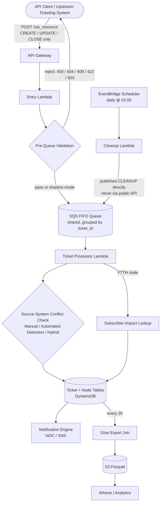

<!-- Illustrative example values (account IDs, hostnames, subscriber counts) throughout this repository are placeholders, not production figures. Project and component names are fictionalized for this portfolio. -->

# Outage State Reconciliation Engine (OSRE)

**Event-driven, serverless pipeline for capturing, validating, deduplicating, and enriching network outage tickets across a fixed-network (HFC/FTTH) telecom footprint serving 500,000+ customers.**

[](#tech-stack)
[](#repository-layout)
[](LICENSE)

**Portfolio case study:** [Production Recovery of an Outage-State Platform — one-page PDF](docs/case-study/Outage_State_Reconciliation_Engine_OSRE_Case_Study.pdf)

> **Portfolio reconstruction scope.** This repository is a sanitized, from-scratch reconstruction of selected production architecture and code patterns. It includes representative ingestion, validation, maintenance, observability, and infrastructure artifacts; it does **not** include the complete proprietary processor, data-management, subscriber-impact, notification, authentication-router, or analytics implementations. The CloudFormation file is therefore a conceptual deployment outline for the included samples, not a turnkey production stack. Example identifiers, URLs, account details, and component names are fictional.

OSRE coordinates an asynchronous outage-ticket lifecycle that resolves conflicts between manually reported and automatically detected outages, maintains a consistent state per network node, and supports customer-impact assessment. Scheduled maintenance enforces stale-ticket lifecycle rules while operators remain responsible for exceptions, incident response, policy, and upstream data quality.

## Why this exists

Two independent systems can report the same outage: a human operator filing a ticket by hand (OTS), and an automated call-volume threshold detector (Automated Detection). Left unreconciled, that's duplicate tickets, conflicting outage states, and customer-facing systems (like an IVR) giving contradictory answers about whether a customer is actually affected. OSRE's core job is turning those two signals into one consistent, real-time picture of network state - with strict validation at the door so bad data never reaches the pipeline in the first place.

## Architecture



Full component breakdown, sequence-by-intent diagrams, and the source-system conflict table live in **[docs/architecture-overview.md](docs/architecture-overview.md)**.

## Tech stack

**API & Compute**
- Amazon API Gateway - unified REST entry point for CREATE/UPDATE/CLOSE
- AWS Lambda (Python 3.11 / 3.13) - entry validation, ticket processing, DB writes, notifications, scheduled cleanup

**Messaging & Eventing**
- Amazon SQS (FIFO) - a single shared lifecycle queue grouped by `ticket_id`, guaranteeing per-ticket ordering across CREATE/UPDATE/CLOSE/CLEANUP, with a content-derived deduplication key
- Amazon EventBridge Scheduler - daily SLA cleanup trigger, periodic analytics export

**Database & Storage**
- Amazon DynamoDB - ticket state, node inventory, customer-impact records (parameterized PartiQL for tolerant ticket-ID lookups)
- Amazon S3 - Parquet exports for downstream analytics
- AWS Secrets Manager - API key storage, read by the upstream router Lambda (not one of this repo's flagship samples - see [docs/api-reference.md](docs/api-reference.md))

**Analytics**
- AWS Glue - scheduled export jobs and crawlers
- Amazon Athena - ad-hoc and dashboard queries over exported ticket/customer data

**Monitoring**
- Amazon CloudWatch - structured JSON logging, Logs Insights queries, custom metrics, dashboards, alarms
- Amazon SNS - failure and cleanup-summary notifications

## Core business logic & rules

### Ticket lifecycle operations

| Intent | Reachable via public API? | Validated? | What it does |
|---|---|---|---|
| `CREATE` | Yes | Yes | Rejects duplicate tickets (by ticket ID, regardless of node overlap) and nodes already in an open outage; rejects requests over 10 nodes |
| `UPDATE` | Yes | Yes | Diffs current vs. requested node list (KEPT/ADDED/REMOVED); handles Automated-Detection→Hybrid promotion |
| `CLOSE` | Yes | Yes | Idempotent by default; sets `closed`/`cancelled` status per source system; clears node outage flags |
| `CLEANUP` | **No - internal only** | No (see [Known Limitations](docs/known-limitations.md)) | Scheduled bulk-close of tickets past the SLA threshold, published directly to the internal lifecycle queue |

### Source-system conflict resolution

| Existing ticket | Incoming signal | Result |
|---|---|---|
| Automated-Detection ticket open on a node | Manual (OTS) ticket arrives for the same node | Promoted to **Hybrid** |
| Manual (OTS) ticket open on a node | Automated-detection threshold triggers for the same node | **Rejected** - already tracked |
| Manual or Hybrid ticket open on a node | New manually-reported ticket arrives for the same node | **Rejected** - duplicate prevention |

Each network node is meant to belong to exactly one open ticket at a time, and this check runs before a request is queued - but it's a read-then-decide guard, not an atomic guarantee against a race between two concurrent requests for different tickets. See [Known Limitations (L6)](docs/known-limitations.md) for the specific gap and the conditional-write fix that would close it. Every one of these checks is also scoped to the request's `OpCo`, so the same ticket or node reused by a different operating company on a shared table is never treated as a conflict with this one - see [Known Limitations (L9)](docs/known-limitations.md) for what that does and doesn't guarantee.

### Pre-queue validation & response envelope

Every request - accepted or rejected - gets an immediate, synchronous HTTP response before anything touches a queue:

| Code | Meaning |
|---|---|
| `200 OK` | Accepted and queued for processing |
| `202 Accepted` | Accepted, but shadow-mode validation would have rejected it |
| `400 Bad Request` | Malformed payload, missing/invalid field, an unsupported intent (`CLEANUP` included), or more than 10 nodes in a single request |
| `404 Not Found` | UPDATE/CLOSE against an unknown ticket - or one CREATEd moments ago whose write hasn't landed yet; see [Known Limitations (L10)](docs/known-limitations.md) |
| `409 Conflict` | Duplicate ticket or node already in an open outage |
| `422 Unprocessable Entity` | Ticket exists but is in an invalid state for this operation |
| `503 Service Unavailable` | Validation backend unreachable - the request is rejected, not silently allowed through unverified |

Full request/response schemas and sample payloads: **[docs/api-reference.md](docs/api-reference.md)**.

## Automated maintenance & analytics

- **Stale-ticket cleanup** runs daily via EventBridge Scheduler, publishing a CLEANUP message directly onto the shared internal lifecycle queue (same queue and `ticket_id` message group as a normal CLOSE) for any ticket past the 72-hour SLA threshold - it never calls the public API, so a client-side API key can never trigger this operation. Pre-queue validation is intentionally bypassed for this path, since a stale ticket may carry data-quality issues that would otherwise block its own closure. See [`src/maintenance/ticket_cleanup_handler.py`](src/maintenance/ticket_cleanup_handler.py) and [Known Limitations (L1)](docs/known-limitations.md).
- **Analytics export** runs every two hours, writing ticket and customer-impact snapshots to S3 as Parquet for Glue/Athena consumption - decoupling historical reporting from the live operational tables entirely.

## Repository layout

```
outage-state-reconciliation-engine/
├── README.md
├── LICENSE
├── .gitignore
├── docs/
│   ├── case-study/                # One-page public portfolio case study (PDF)
│   ├── architecture-overview.md   # Components, sequence flows, conflict-resolution rules
│   ├── api-reference.md           # Request/response schemas, status codes, sample payloads
│   ├── known-limitations.md       # Current limitations, security boundaries, resolved issues, planned improvements
│   ├── audit-history.md           # Full round-by-round rationale behind known-limitations.md, for anyone who wants the detail
│   └── observability.md           # Log groups, CloudWatch Insights queries, alerting thresholds
├── infra/
│   └── cloudformation/
│       └── outage-pipeline-stack.yaml   # Representative IaC excerpt (queues, DLQ, entry Lambda, scheduled cleanup)
├── src/
│   ├── ingestion/
│   │   └── entry_handler.py             # API Gateway entry point, response envelope, per-intent routing
│   ├── validation/
│   │   └── prequeue_validation.py       # Dedup + node-conflict validation engine
│   └── maintenance/
│       └── ticket_cleanup_handler.py    # Scheduled SLA enforcement, internal-only
├── dashboards/
│   └── operations-dashboard.json        # CloudWatch dashboard definition (log-group names match the `prod` environment; swap the `-prod` suffix for `-dev`)
└── tests/
    ├── README.md                        # Historical evidence boundary and broader scenario catalog
    └── test_public_contract.py          # Sanitized executable tests for the reconstructed samples
```

## Conceptual deployment and API integration outline

The examples below illustrate the public request contract using fictional values. They are not a deployment quickstart: this portfolio intentionally omits several proprietary production components, and the included CloudFormation is representative rather than complete.

Every client-facing operation goes through a single endpoint, differentiated by an `intent` field (`CREATE`, `UPDATE`, `CLOSE` only - `CLEANUP` is internal-only, see above):

**Create a ticket**
```bash
curl -X POST "https://api.example.com/prod/ots_resource" \
  -H "X-Api-Key: $OUTAGE_API_KEY" \
  -H "Content-Type: application/json" \
  -d '{
    "OpCo": "ACME",
    "intent": "CREATE",
    "id": "774471",
    "category": "FTTH Access",
    "Devices": "DEMO-NODE-001,DEMO-NODE-002",
    "correlation_id": "b3b7e6b0-1a2b-4c3d-9e8f-0123456789ab"
  }'
```

**Update a ticket's node list**
```bash
curl -X POST "https://api.example.com/prod/ots_resource" \
  -H "X-Api-Key: $OUTAGE_API_KEY" \
  -H "Content-Type: application/json" \
  -d '{"OpCo": "ACME", "intent": "UPDATE", "id": "774471", "Devices": "DEMO-NODE-001,DEMO-NODE-002,DEMO-NODE-003"}'
```

**Close a ticket**
```bash
curl -X POST "https://api.example.com/prod/ots_resource" \
  -H "X-Api-Key: $OUTAGE_API_KEY" \
  -H "Content-Type: application/json" \
  -d '{"OpCo": "ACME", "intent": "CLOSE", "id": "774471"}'
```

Every request carries (or is assigned) a `correlation_id`, propagated through the entry Lambda, the SQS message, the processor, and the DB-write Lambda. One CloudWatch Logs Insights query reconstructs a ticket's full path through the components that emit structured logs; the DB-write and notification Lambdas still carry the ID in the message data but log with plain `print()` (see [Known Limitations](docs/known-limitations.md)), so a query against those two hops' log groups needs to grep rather than filter on a structured field. Full schema and error-envelope examples: [docs/api-reference.md](docs/api-reference.md).

## Observability & operational metrics

- **Structured JSON logging** with a consistent field schema (`correlation_id`, `ticket_id`, `intent`, `processing_status`, `error_type`) across the components that have adopted it - see [Known Limitations](docs/known-limitations.md) for the ones that haven't yet.
- **Correlation-ID tracing** end-to-end across the pipeline's participating/migrated components - see [Known Limitations](docs/known-limitations.md) for the components still on plain-text logging, where the ID is still propagated in the message data but isn't yet reliably queryable as a structured log field.
- **CloudWatch dashboards** for real-time operations (request volume, validation success rate, queue depth, error rate) and historical business intelligence (SLA compliance, category distribution, customer impact).
- **Alerting baselines**: validation failure rate >25%, SQS queue depth >100, Lambda error rate >5%, and a missed daily cleanup run (>25h since last execution) are all treated as critical.
- **Data handling & logging scope**: structured operational logs retain correlation IDs and the minimum ticket/node identifiers required to confirm request delivery and diagnose time-sensitive processing failures. Full request payloads, subscriber data, authentication material, and detailed topology attributes are excluded, and exception text written to logs or notifications is truncated rather than passed through raw. See [Known Limitations](docs/known-limitations.md) for the full policy.

Full log-group map, Logs Insights query catalog, and alerting thresholds: **[docs/observability.md](docs/observability.md)**.

## Known limitations & design decisions

This system makes a few deliberate tradeoffs that look unusual out of context - synchronous Lambda chaining to close one race-condition window, CLEANUP built to be structurally unreachable from the public API, validation that fails *closed* (on total **and partial** backend failures) rather than open, a single shared FIFO queue instead of one per intent so lifecycle ordering is actually guaranteed, and CLOSE treated as idempotent by default. It also documents honest gaps that aren't yet closed: node-conflict validation is a read-then-decide check, not an atomic write-time guarantee (L6); ticket-uniqueness detection is a bounded, paginated scan rather than an indexed lookup, so it narrows rather than eliminates a false-negative window on a large enough table (L8); `OpCo` scopes duplicate/conflict checks correctly but isn't tied to caller authorization - it's a data-scoping field here, not an access-control one (L9); a CREATE that returns `200` can be immediately followed by an UPDATE/CLOSE that 404s because the ticket write itself happens asynchronously downstream (L10); and a request that collides with SQS FIFO's content-based dedup gets back a `correlation_id` that's valid for its own response but never appears in any downstream log, since the dedup hash deliberately excludes `correlation_id` to make dedup work at all (L11). Each of these - along with planned improvements such as broader automated coverage, a GSI on `Ticket_Number`, end-to-end structured logging, and optimistic locking - is summarized in **[docs/known-limitations.md](docs/known-limitations.md)**, with the full round-by-round rationale in **[docs/audit-history.md](docs/audit-history.md)**.

## License

MIT - see [LICENSE](LICENSE).

---

*This repository is a sanitized, standalone illustration of a production system's architecture and code patterns, built for a portfolio. Company-identifying names, account IDs, internal hostnames, and real infrastructure identifiers have been replaced with generic placeholders, example node/ticket identifiers are fictional, and project/component names are fictionalized; the business logic, validation rules, and architectural decisions are representative of the real system.*
