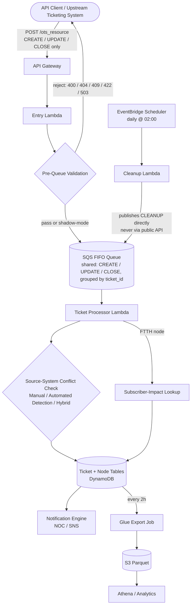

# Logical Architecture

## System overview

This system coordinates the lifecycle of network outage tickets - creation, real-time updates, closure, and scheduled stale-ticket cleanup - for a fixed-network (HFC and FTTH) footprint serving 500,000+ customers. It consolidates fragmented manual and automated outage signals through an event-driven pipeline that validates requests before processing, resolves source-system conflicts, and supports real-time customer-impact assessment.

## Logical components

**API Gateway layer** - unified entry point for CREATE/UPDATE/CLOSE operations only. CLEANUP is not accepted here - see [Known Limitations (L1)](known-limitations.md) for why that's a structural exclusion, not just a documented convention. A router Lambda in front of the entry Lambda validates the `X-Api-Key` header against a value in AWS Secrets Manager and dispatches by operating company; that router isn't one of this repo's flagship code samples, so its code and the Secrets Manager resource it reads aren't included here (see [api-reference.md](api-reference.md)). `OpCo` itself is treated as caller-supplied, untrusted data throughout this illustrative implementation: it scopes data lookups but is not used anywhere as an authorization credential; see [Known Limitations (L9)](known-limitations.md) for what a production deployment would need to add to close that gap. Correlation-ID assignment and request routing happen in the entry Lambda shown in this repo ([`src/ingestion/entry_handler.py`](../src/ingestion/entry_handler.py)).

**Pre-queue validation engine** - checks data quality *before* a request is allowed onto the processing queue. Runs in one of two modes: shadow (log-only, for safely rolling out new rules) or enforce (blocks invalid requests with an immediate HTTP response). A backend failure during a check fails the request closed (`503`), not open - see [Known Limitations (L7)](known-limitations.md). Every check is scoped to the request's `OpCo` (see [L9](known-limitations.md)). Because CREATE only enqueues a message here and the ticket itself is written later by the ticket processor below, an UPDATE/CLOSE for the same ticket arriving in the same instant can run its existence check ahead of that write and see a `404` - see [Known Limitations (L10)](known-limitations.md).

**Request queue (SQS FIFO)** - a single shared lifecycle queue for CREATE, UPDATE, and CLOSE, decoupling ingestion from processing. Grouping every message by `MessageGroupId=ticket_id` is what guarantees ordering *per ticket ID* - an earlier design split intents across three separate queues, which never actually enforced that ordering, since FIFO only orders within one queue and group (see [Known Limitations - Major resolved issues](known-limitations.md#major-resolved-issues), and [Design rationale](#design-rationale) below for the full tradeoff). Also deduplicates retried requests via a content-derived deduplication key. CLEANUP messages are published directly onto this same queue, in the same ticket_id group, by the scheduled cleanup Lambda - never through API Gateway. This ordering guarantee applies to messages once they're enqueued; it doesn't reach back to cover the pre-queue validation race described in the paragraph above - see [Known Limitations (L10)](known-limitations.md).

**Ticket processor** - the core state machine. Determines INSERT vs. SKIP on CREATE, diffs the current and requested node lists on UPDATE (tracking KEPT / ADDED / REMOVED), and computes outage duration on CLOSE.

**Data management layer**
- *Ticket table* - ticket metadata, lifecycle state, `Source_System` (Manual/OTS, Automated Detection, or Hybrid), SLA timestamps.
- *Customer impact table* - links subscribers to affected nodes, tracks per-customer outage duration.
- *Node inventory* - network node metadata: technology type (HFC / FTTH), geography, subscriber capacity.

**External integration layer**
- *Subscriber-impact API* - queried for FTTH/GPON nodes only, to get a live active-session count for real-time impact sizing.
- *Upstream ticketing system (OTS)* - the external, human-operated system that originates manually-reported tickets and receives ticket-state callbacks. Represented generically in this portfolio.

**Notification engine** - alerts NOC/network engineering on ticket creation, state changes, and SLA threshold breaches.

**Analytics & reporting layer** - historical ticket data, customer impact analysis, SLA compliance, and trend reporting via a scheduled S3/Parquet export consumed by Glue/Athena.

**Scheduled maintenance** - a daily job publishes CLEANUP messages directly onto the shared lifecycle queue for tickets that have exceeded the SLA threshold (see [Known Limitations](known-limitations.md) L1 and L7 for why this bypasses validation and how it's kept from being externally triggerable), and a separate job exports ticket and customer-impact snapshots every two hours for downstream analytics.

## Processing flow



### CREATE

1. API Gateway authenticates and assigns a correlation ID.
2. Pre-queue validation confirms the ticket doesn't already exist (checked by ticket ID, not just by node overlap, via a bounded/paginated lookup rather than an unpaginated one - see [Known Limitations - Major resolved issues](known-limitations.md#major-resolved-issues) and [L8](known-limitations.md)) and none of its nodes are already on an open ticket under the same `OpCo` (see [Known Limitations L6](known-limitations.md) for why this check, on its own, doesn't fully close a race between two concurrent requests for different tickets, and [L9](known-limitations.md) for the `OpCo` scoping). Requests naming more than 10 nodes are rejected outright before validation runs.
3. Accepted requests are enqueued (FIFO, per-ticket ordering) and processed asynchronously: nodes are linked to the ticket, `Outage_Flag` is set, and - for FTTH - a subscriber-impact lookup runs.
4. NOC is notified of the new ticket.

### UPDATE

1. Validation confirms the ticket exists and is open.
2. The processor diffs the current node list against the requested one (KEPT / ADDED / REMOVED) and applies an Automated-Detection→Hybrid source-system promotion if applicable (see below).
3. Node and ticket metadata are updated; NOC is notified of the change.

### CLOSE

1. Validation confirms the ticket exists. Closing an already-closed ticket is treated as idempotent success by default, rather than an error.
2. The processor sets ticket status (`closed` for Manual/OTS and Hybrid tickets, `cancelled` for Automated-Detection-only tickets), clears `Outage_Flag` on every associated node, and computes outage duration.
3. Customer-impact records are finalized and a closure notification is sent.

### CLEANUP (automated, internal-only)

1. A daily scheduled job queries for tickets open longer than the SLA threshold (default 72h).
2. Nodes are grouped by ticket and a CLEANUP message is published directly onto the shared lifecycle queue per ticket - the same queue, `ticket_id` message group, and message shape a normal CLOSE uses. Pre-queue validation is bypassed for this intent; see [Known Limitations](known-limitations.md) for why, and for how CLEANUP is kept from ever being reachable through the public API in the first place.
3. Tickets are closed with `reason='STALE_TICKET_72H'` and a summary report is sent.

## Source-system conflict resolution

A ticket can originate from one of two sources, and the system's core deduplication rule is about reconciling them onto the same node:

- **Manual (OTS)** - created directly through the upstream ticketing system (human-initiated).
- **Automated Detection** - proactively opened by an automated call-volume threshold detector.

| Existing ticket | Incoming signal | Result |
|---|---|---|
| Automated-Detection ticket open on a node | A manually-reported (OTS) ticket arrives for the same node | Promote to **Hybrid** (automated detection confirmed by a human-reported ticket) |
| Manual (OTS) ticket open on a node | Automated-detection threshold triggers for the same node | **Reject** - already tracked, avoids a duplicate ticket |
| Manual or Hybrid ticket open on a node | A new manually-reported ticket arrives for the same node | **Reject** - duplicate prevention |

Each node is *meant* to belong to exactly one open ticket at a time, and the validation layer checks this before a request is queued - but that check is a read-then-decide guard, not an atomic guarantee. See [Known Limitations (L6)](known-limitations.md) for the specific race it doesn't close and the conditional-write fix that would close it at the point nodes are actually attached to a ticket.

## Data flow patterns

- **Synchronous** - `Client → API Gateway → Validation → immediate response`, used for the pass/fail decision on every request.
- **Asynchronous** - `Client → API Gateway → Queue → eventual processing`, used for the actual ticket/node mutation once a request has passed validation.
- **Event-driven maintenance** - `EventBridge schedule → query → publish directly to queue → notify`, used for stale-ticket cleanup and periodic analytics export.

## Design rationale

**Why SQS FIFO instead of a standard queue?** Ordering (UPDATE must be processed after the CREATE that opened the ticket) outweighs the throughput ceiling of FIFO, which - using `FifoThroughputLimit: perMessageGroupId` and a per-message-group dedup scope - scales with the number of distinct tickets in flight rather than being capped at one queue-wide limit, comfortably above current load. FIFO's content-based dedup is a useful backstop against a retried request producing two messages (now that the dedup ID is content-derived rather than random - see [known-limitations.md](known-limitations.md)), but see [Known Limitations (L6)](known-limitations.md) for what it does *not* protect against.

**Why validate before the queue instead of during processing?** Immediate feedback beats delayed failure - callers previously reported frustration with a ticket failing minutes after submission, once it reached the processor. Pre-queue validation costs some request latency (roughly 100-200ms for the DynamoDB lookup) in exchange for the caller knowing immediately whether their request was accepted.

**Why is CLEANUP structurally excluded from the public API rather than just skipping validation for it?** An earlier design let CLEANUP through the same public endpoint as CREATE/UPDATE/CLOSE and simply skipped validation for that intent, trusting that "only the schedule sends this." That trust was misplaced - anything with a valid API key could submit it too. Removing the intent from the public surface entirely, and making the scheduled Lambda talk directly to the internal queue via IAM, closes the gap structurally instead of relying on caller good faith.

**Why synchronous (not async) invocation from the processor to the DB-write Lambda?** A real-time customer-facing lookup (an IVR-style "am I affected by an outage" query) reads the same ticket/node state this pipeline writes. An async write introduces a race window where that lookup could run before the write lands, telling a customer they aren't affected by an outage that has, in fact, already been logged against their node. Synchronous chaining trades some cost efficiency and throughput for a hard guarantee against that race, until optimistic locking (version-checked conditional writes) is implemented to make async safe.

```python
# Planned fix: optimistic locking instead of synchronous chaining
response = table.update_item(
    Key={'ticket_id': ticket_id},
    UpdateExpression='SET outage_flag = :flag, version = :new_version',
    ConditionExpression='version = :current_version',
    ExpressionAttributeValues={
        ':flag': 'Y',
        ':current_version': current_version,
        ':new_version': current_version + 1,
    },
)
# ConditionCheckFailedException -> retry with the refreshed version
```

The same conditional-write pattern is the eventual fix for the node-conflict race in [Known Limitations (L6)](known-limitations.md), applied to node claims instead of ticket versions.

**Why one shared lifecycle queue instead of one per intent?** An earlier design routed CREATE, UPDATE, and CLOSE to three separate FIFO queues (with CLEANUP sharing the CLOSE queue), reasoning that it let CLOSE be prioritized ahead of UPDATE, scaled each intent independently, and isolated failures - a CREATE-processing issue wouldn't back up CLOSE. That reasoning had a fatal gap: FIFO orders messages within one queue and message group only, never across queues, so nothing was actually serializing a ticket's CREATE against its own UPDATE or CLOSE - a fast-arriving UPDATE could reach the processor first despite the docs claiming otherwise. A single `LifecycleTicketQueue`, still grouped by `MessageGroupId=ticket_id`, is what makes that ordering real: every message for a given ticket - CREATE, UPDATE, CLOSE, or CLEANUP - lands in the same group and is delivered in send order. The tradeoff is real and intentional: this repo no longer isolates a CREATE-processing backlog from CLOSE, and can't prioritize one intent's traffic over another's at the queue level. If that isolation becomes a real operational need, the correct fix is a priority mechanism *within* the shared queue's consumer (e.g. a lightweight priority field the processor checks) rather than reintroducing separate queues, which is what broke ordering in the first place.

**Why Lambda versions instead of aliases for rollback?** Simpler operationally - a version number is an explicit, immutable record of what's deployed. No blue/green or weighted canary routing, but nothing in the current rollback requirements needs it.

**Why reject a request with more than 10 nodes instead of validating/queuing it in batches?** An earlier version silently capped how many nodes it would check for conflicts (10 for the existence check, 50 for the conflict check) while still queuing the *entire* submitted list for processing - so a request with, say, 30 nodes got only a fraction of its nodes actually validated before being accepted. More than 10 affected nodes on a single outage ticket doesn't correspond to a realistic single event for this line of business, so there's no good reason to validate a truncated slice of an oversized request instead of just rejecting it: `entry_handler.py` now hard-rejects any request over the 10-node cap with `400` before validation ever runs, and `prequeue_validation.py` enforces the same cap as defense-in-depth. This also resolved the mismatched 10-vs-50 caps between the two validation functions, which had no documented reason to differ.

## Glossary

| Term | Meaning |
|---|---|
| HFC | Hybrid Fiber-Coaxial (cable access technology) |
| FTTH | Fiber to the Home (GPON access technology) |
| OTS | The external, operator-facing ticketing system that originates manually-reported tickets; represented generically in this portfolio. |
| Automated Detection | A ticket opened automatically by a call-volume threshold detector, without human input. |
| Hybrid | An Automated-Detection ticket promoted to Hybrid after a manually-reported (OTS) ticket confirms the same node. |
| SLA | 72-hour target for ticket closure; enforced by the daily cleanup job |
| NOC | Network Operations Center |
| Outage_Flag | Per-node boolean ('Y'/'N') indicating whether the node is currently in an active outage |
| Containment | Boolean flag indicating a full loss-of-service outage (as opposed to degraded service) |
